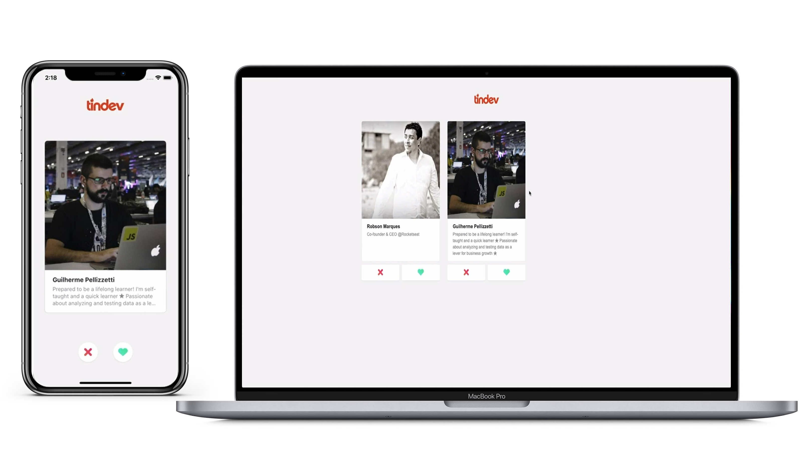

<h1 align="center">
    
</h1>

<h4 align="center">
  🚀 Semana OmniStack 7.0
</h4>

  

  
  
  

  

  <a href="#rocket-tecnologias">Tecnologias</a>&nbsp;&nbsp;&nbsp;|&nbsp;&nbsp;&nbsp;
  <a href="#-projeto">Projeto</a>&nbsp;&nbsp;&nbsp;|&nbsp;&nbsp;&nbsp;
  <a href="#clipboard-documentação">Documentação</a>

 

  

## :rocket: Tecnologias

Esse projeto foi desenvolvido com as seguintes tecnologias:

- [Node.js](https://nodejs.org/en/)
- [React](https://reactjs.org)
- [React Native](https://facebook.github.io/react-native/)

## 💻 Projeto

Com o Instarocket é possível enviar, visualizar e curtir fotos de seus amigos!

## :clipboard: Documentação

Para acessar a documentação, [clique aqui](link)

